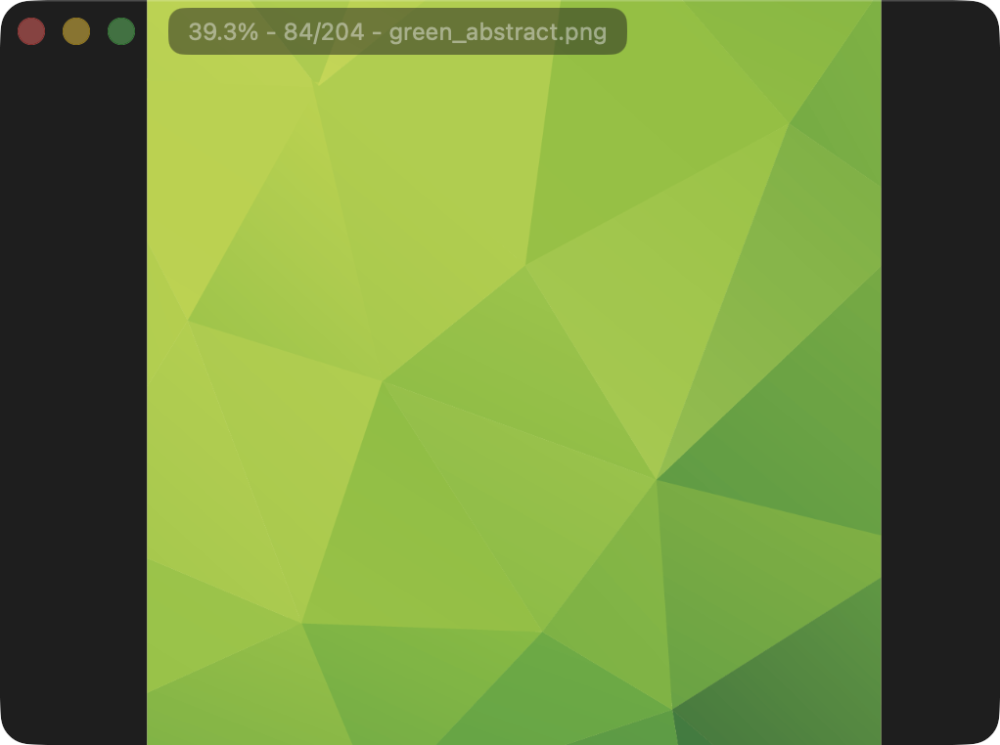

# SimpView

SimpView is a small, native image viewer for macOS, written in Swift.
It displays any image format that macOS can decode.
It's built for fast, keyboard/gesture-friendly browsing.

## Features

- Fast folder-based browsing with arrow-key navigation, jump navigation (e.g. skip forward/back 50 images via ⌥→/⌥←), and random image navigation.
- Flexible zoom options including Zoom to Fit, Zoom to Fill, Actual Size, and Zoom In/Out with customizable step.
- Adjacent-image preloading (optional).
- Multi-window workflow with recent files, Show in Finder, and session restore support.
- Mouse gestures: Precise scroll to zoom, pinch to zoom, sideways swipe to navigate, middle click for Zoom to Fit, ⌘ middle click for Zoom to Fill.
- Simple built-in preferences for sort order, navigation speed (when holding down arrow keys), jump distance, title bar hiding, etc.
- Lightweight and minimal. No buttons/toolbars in the viewer, no image thumbnail browser, no editing, no animation support, no metadata viewing, etc. If you need those, look elsewhere.

## Supported Platforms

- macOS 15+, Apple silicon only

## Tips

- Middle click can be done via trackpad with [Middle](https://middleclick.app/) or [Multitouch](https://multitouch.app/). The latter requires setting `defaults write com.brassmonkery.Multitouch clickModifierPassThrough -int 1` for Command-key modifier functionality (i.e. Zoom to Fill).
